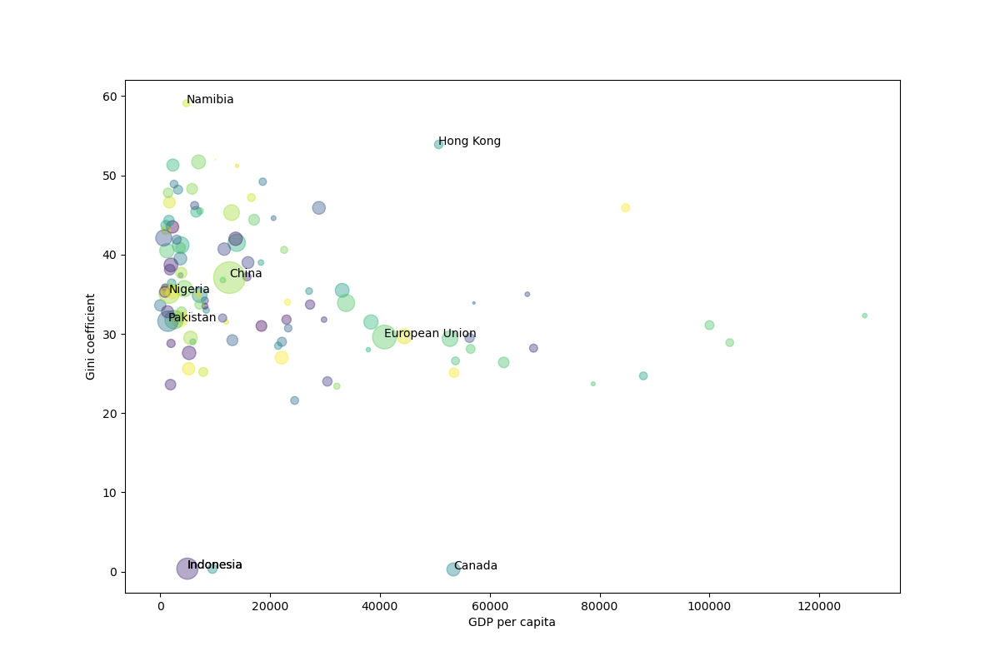

# Scraping

**Is there a relationship between income inequality, population size, and wealth?**

We often encounter scenarios where the data needed isn't readily available in machine-readable formats like CSV files, but rather embedded within websites. Although machine-readable data for our question exists, let's assume for this exercise that we're limited to using only Wikipedia.

For instance, Wikipedia has a [lists of countries by GDP per capita](https://en.wikipedia.org/wiki/List_of_countries_by_GDP_(nominal)_per_capita), which we can use as a proxy for a country's wealth. Linked within these entries is also information on the [Gini coefficient](https://en.wikipedia.org/wiki/Gini_coefficient), which indicates income inequality. (If you're an economist, I apologize for the oversimplification.)

Our goal is to use Wikipedia data to create a plot similar to this:

To achieve this, you'll need to write a script that can extract data from a HTML source—a process known as scraping. It's important to note that many companies dislike of scraping, and take measures against it.

Wikipedia doesn't specifically prohibit scraping, but to prevent any issues and ensure data consistency during your project, we've provided a bare-bones copy of the relevant webpages for you to practice on: [Fake Wiki](https://spcourse.github.io/wiki/).

You'll develop the script in two phases. First you focus only on GDP per capita data. After that you'll also include data on the Gini coefficient and population.

## Getting started

### Pipeline

We'll divide the process into two main steps:

1. **Data Acquisition**: Create a script to scrape the Fake Wiki, extract data into a Pandas dataframe, and save it as a CSV file.
2. **Data Visualization**: Develop another script to read the CSV file into a Pandas dataframe and generate a plot.

Using separate scripts for scraping and visualization simplifies maintenance and debugging.

### Libraries

This assignment requires three libraries:

- **BeautifulSoup** for parsing the Document Object Model (DOM). We provide some initial code for the exercise. [BeautifulSoup documentation](https://www.crummy.com/software/BeautifulSoup/bs4/doc/)
- **Pandas** for managing data in Python. [Pandas documentation](https://pandas.pydata.org/docs/)

### Downloading Webpages

First, you need to download the relevant webpage using the `requests` package. Below are some functions to get you started:

    from requests import get, RequestException
    from contextlib import closing
    import time

    def simple_get(url, max_retries=3):
        """
        Attempts to get the content at `url` by making an HTTP GET request.
        If the content-type of response is some kind of HTML/XML, return the
        text content, otherwise return None.
        Retry up to `max_retries` times on HTTP errors with a 1-second delay.
        """
        try:
            headers = {
                'User-Agent': 'Mozilla/5.0 (Windows NT 6.1; WOW64) AppleWebKit/537.36 (KHTML, like Gecko) Chrome/56.0.2924.76 Safari/537.36'
            }
            for _ in range(max_retries):
                with closing(get(url, stream=True, headers=headers)) as resp:
                    if is_good_response(resp):
                        return resp.content
                    else:
                        print(f"Recieved a HTTP {resp.status_code} ERROR for {url}.")
                        print("Retrying in 1 second...")
                        time.sleep(1)
            print("-------------------------------------")
            print(f"Retrieving {url} FAILED. Visit this URL in your browser to confirm correctness.")
            print("-------------------------------------")
            return None
        except RequestException as e:
            print(f"The following error occurred during HTTP GET request to {url}: {str(e)}")
            return None

    def is_good_response(resp):
        """
        Returns true if the response seems to be HTML, false otherwise.
        """
        content_type = resp.headers['Content-Type'].lower()
        return (resp.status_code == 200
                and content_type is not None
                and content_type.find('html') > -1)

### BeautifulSoup

To scrape data from webpages, we use BeautifulSoup — a Python library for extracting data from HTML and XML files. It simplifies the process of navigating, searching, and modifying the parse tree.

Begin with the following tutorial on HTML and the DOM. Ignore any reference to JavaScript (you may replace it in your mind with BeautifulSoup), as it will not be needed in our exercises.

### Building `scraper.py`

Start by writing a script (`scraper.py`) that loads the correct Wiki address, uses the function above to download the webpage, parses the HTML with BeautifulSoup, and extracts the header text:

    from bs4 import BeautifulSoup

    WIKI_URL = 'https://spcourse.github.io/wiki/'

    html = simple_get(WIKI_URL)
    dom = BeautifulSoup(html, 'html.parser')
    title = dom.find('header', {'class': 'mw-body-header'})
    print(title.text)

## Specification

- Extend `scraper.py` to locate GDP per capita information (**using the World Bank source**) in the DOM and create a Pandas DataFrame with two columns: `country-name` and `gdp-per-capita`. The DataFrame should then be saved to a CSV file, formatted as follows (but with all 222 countries listed):

    country-name,gdp-per-capita
    Monaco,240862
    Liechtenstein,187267
    Luxembourg,128259
    Bermuda,123091
    Ireland,103685
    Switzerland,99995
    ...

- If the GDP information is missing you should set the value to -1.
- Make sure that the output csv file can be specified as a command line argument. So you should be able to call the script as follows:

    python scraper.py name-of-output-file.csv

## Hints

### Find DOM Objects

You will frequently need to use the `find()` and `find_all()` methods. For example, to locate and print the row for Iceland in the GDP table:

    all_tables = dom.find_all('tbody')  # get all tables in the website
    gdp_table = all_tables[1]           # second table in the site
    all_rows = gdp_table.find_all('tr') # get all rows
    print(all_rows[12])                 # Show the 12th row (Iceland)

### Extracting Text

To extract the text from a DOM element you can use the `text`-field. For instance, the following piece of code prints all the texts of the cells in row 12.

    cells_row_12 = all_rows[12].find_all('td')
    for cell in cells_row_12:
        print(cell.text)

### DOM inspector

The DOM inspector of your web browser is your biggest ally. In Chrome you can right-click an element and click 'inspect', or you can use F12 (fn+F12 on most laptops) to toggle the inspector. All popular browsers have similar functionality.

### Come to class

If you encounter difficulties, attending class can often help to find quick solutions to common issues. This is generally good advice, but specifically so for this assignment.

### Potential Challenges

- Converting the GDP information to an integer or float is not trivial; consider how you might accomplish this.
- Not every row contains the same number of cells due to missing data, which may complicate finding the cell that contains the World Bank GDP figure.
