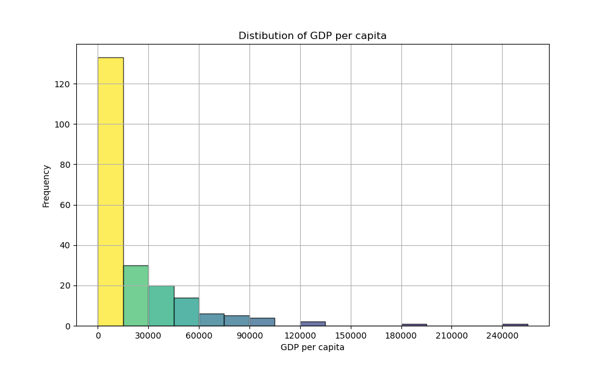

# Visualize GDP Per Capita

## Specification

Create a program named `visualize_gdp.py` that generates a histogram showing the distribution of GDP per capita from data collected in the previous assignment. Execute the program with the following command:

    python visualize_gdp.py gdp_per_capita.csv

Use the first filename provided via the command line to load the data into a pandas DataFrame, then clean the data, and generate a histogram using [Matplotlib](https://matplotlib.org/) or [Seaborn](https://seaborn.pydata.org/).

Your resulting plot could resemble the example below. You can add your own design elements, but ensure the histogram is clear and easy to understand. Save your plot to `gdp_barplot.png`.

> Remember to exclude countries containing missing values (marked as `-1`) from your plot!
