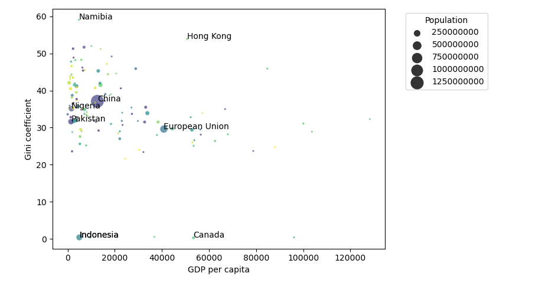

# Visualize the Gini Coefficient, Population, and GDP per Capita

## Specification

Create a program named `visualize_gini.py` that generates a histogram showing the distribution of GDP per capita from data collected in the previous assignment. Execute the program with the following command:

    python visualize_gini.py gdp_per_capita3.csv

The program should load the data into a Pandas DataFrame and create a scatter plot. The resulting plot should clearly show all three variables (Gini Coefficient, Population, and GDP per capita), we did this by showing GDP per capita on the x axis, Gini Coefficient on the y axis and made the size of the marker represent the size of the country, as you can see here below, but feel free to be creative and show the results in a different way.

Remember to exclude countries containing missing values (marked as `-1`) from your plot.
